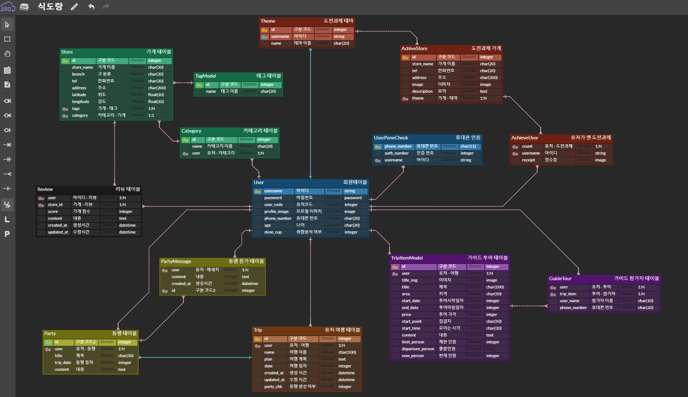

# 식도랑

- 목적 : 음식점 기반 여행 기획 및  추천 플랫폼
- 개발 기간 : 20.08.31 ~ 20.10.08 (6주)
- [베포링크](http://j3d202.p.ssafy.io/)

## 목차

- [1. 팀 구성원 및 업무 분장](#팀-구성원-및-업무-분장)

- [2. 와이어 프레임](#와이어-프레임)

- [3. DB 모델링](#DB-모델링)

- [4. 식도랑 시퀀스](#식도랑-시퀀스)

- [5. 핵심 기능](#핵심-기능)

- [6. 느낀점](#느낀점)

## 팀 구성원 및 업무 분장

#### 정승희

 - 팀장 / QA / 프론트
   	- 1
   	- 2

#### 박인영

- 테크리더 / 프론트
  - 최종 코드리뷰 담당자
  - 모바일 웹 최적화

#### 박도희

- 기획 / 프론트
  - 1
  - 프로젝트 동영상 편집

#### 조규성

- 풀스택
  - 형태소 분석
  - 디버깅

#### 허성수

- 백엔드 / 배포
  - DB 모델링 설계 및 API 로직 작성
  - EC2, Jenkins, Nginx, uwsgi 를 통한 배포

## 와이어 프레임

- [식도랑_와이어프레임.pdf](README_img/식도랑_와이어프레임.pdf) 

- [식도랑_와이어프레임2.pdf](README_img/식도랑_와이어프레임2.pdf) 

- [식도랑 와이어프레임3.pdf](README_img/식도랑_와이어프레임3.pdf)

## DB 모델링

## 식도랑 시퀀스

- [식도랑_시퀀스.md](README_img/식도랑_시퀀스.md)

## 핵심 기능

> **사용자와 연결된 태그, 카테고리를 필터링하여 음식점, 카페, 숙박, 관광지와 같은 여행 일정 추천 알고리즘 제공**
>
> 다이닝코드 식당 데이터, 한국관광공사 API를 사용하여 약 5만건의 데이터를 필터링
>
> 이상형 월드컵을 통해 초기 데이터 확보 및 코사인 유사도 분석으로 콜드스타트 문제 해결
>
> 카카오 map API를 사용하여 사용자가 고르거나 식도랑에서 추천받은 지점 자동으로 연결 및 거리 분석
>
> 리뷰를 쓰면 형태소 분석을 통해 리뷰에 사용한 글자 기반으로 사용자 태그 업데이트 구현
>
> IAMPORT API를 사용하여 이니시스, 카카오, 네이버페이 등 다양한 결제 시스템 구축
>
> Pytesserect, Open CV를 통해 영수증, 결제내역 분석으로 자동 방문 인증 구현

#### 구현기능

휴대폰 인증을 통한 가이드 권한 획득

사용자 여행 생성 후 동행구하기 활성화 가능

가이드일 경우 투어 생성을 통해 결제시스템 사용 가능

GeoLocation API를 통해 현재 위치 획득

---

## 느낀점

**정승희**

- 

**박도희**

- 

**박인영**

- 

**조규성**

1. 디버깅에 엄청 익숙해졌다. 자바스크립트의 동작, 특히 비동기처리에대해 고민해볼 수 있었다.
2. 뷰의 장점인 컴포넌트화, 데이터 중앙처리에 부족함이 많이 느껴져서 안타까웠다.
3. 리뷰 형태소 분석 후에 유의미한 데이터로 저장하는 과정이 흥미로웠다.

**허성수**

1. Rest-framework의 역할과 Django기반의 백 구성에 대해 많이 고민했고 배웠다
2. Ubuntu 기반 Vue.js와 Django 배포에 대해 배웠고 프록시 설정법 또한 배운 기회가 되었다
3. HTTPS를 구성할 때 SSL 인증 방식과 접근 권한, 데이터 폼 처리에 대해 고민해 볼 수 있었다.

---